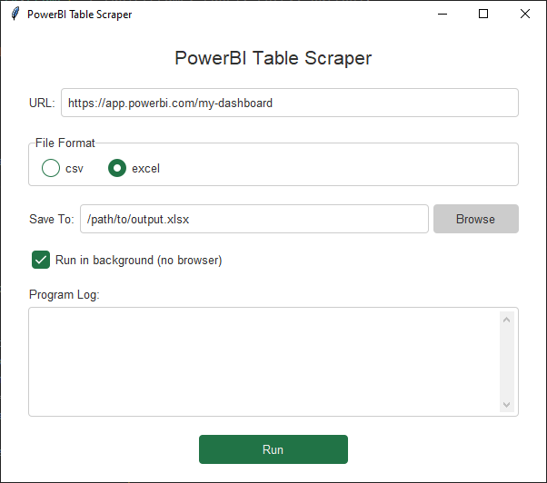

# powerbi-table-scraper

[](https://github.com/holstt/powerbi-table-scraper/actions/workflows/ci.yml)
[](https://www.python.org)
[](https://python-poetry.org/)
[](https://github.com/psf/black)
[](https://microsoft.github.io/pyright/)

Python tool for scraping Power BI tables into an Excel or CSV file using Selenium. The tool can be run as a console application or with a GUI.



## Prerequisites

-   [Python 3.11](https://www.python.org/downloads/release/python-311/)
-   [Poetry](https://python-poetry.org/docs/) (optional)

## Installation

1. Clone the repository:

```bash
git clone https://github.com/holstt/powerbi-table-scraper.git
cd powerbi-table-scraper
```

2. Install dependencies using Poetry:

```bash
poetry install
```

For non-poetry users, a `requirements.txt` file is also provided.

## Configuration

To set up configuration:

1. Rename `config.example.yml` to `config.yml`.

2. Update the `config.yml` file with your specific settings.

-   To switch between GUI and Console mode, change the `mode` value to either `gui` or `console`.
-   Depending on the mode, the `gui` or `console` section of the config file will be used. The other section will be ignored, but you can keep it in the file if you still want to have the possibility to switch between modes.

```yml
# EXAMPLE CONFIG FILE

mode: gui # REQUIRED: Options: gui or console

should_uncheck_filter: true # OPTIONAL (default=false): Find checkbox filter and uncheck all checkboxes before scraping
max_rows: null # OPTIONAL (default=None): Set a maximum number of rows to scrape (e.g. for reducing scraping time during testing)

console:
    url: https://app.powerbi.com/XXXXX # REQUIRED: URL to the Power BI report that should be scraped
    is_headless: true # OPTIONAL (default=true): 'true' hides the the browser window during scraping
    output_format: excel # OPTIONAL (default=excel): Options: excel, csv
    output_path: ./table.xlsx # OPTIONAL (default="./table.xlsx"): File extension should match the output_format (i.e. .xlsx for excel and .csv for csv)

gui:
    language: en # OPTIONAL (defaul=en): Options: en, da
    program_name: Power BI Table Scraper # OPTIONAL (defaul=Power BI Table Scraper) The program name that should be displayed in the GUI

    # Default values in the GUI. Can be changed by the user.
    default_values:
        url: https://app.powerbi.com/XXXXX # OPTIONAL (default=None): URL to the Power BI report that should be scraped
        is_headless: true # OPTIONAL (default=true): 'true' hides the the browser window during scraping
        output_format: excel # OPTIONAL (default=excel): excel or csv
        output_path: null # OPTIONAL(default=None): User is always required to browse for a valid path before being able to run the scraper unless a default path is specified here. File extension should match the output_format (i.e. .xlsx for excel and .csv for csv)
```

i.e. the minimum required configuration for the console mode is:

```yml
mode: console
console:
    url: https://app.powerbi.com/XXXXX
```

and for the GUI mode:

```yml
mode: gui
```

## Usage

After setting up `./config.yml`:

```bash
python main.py
```

For the GUI mode, follow the on-screen instructions. For the Console mode, scraping will start automatically based on the settings defined in `config.yml`.

## Creating a Standalone Executable with PyInstaller

To create a standalone executable of the tool, run the following command:

```bash
pyinstaller --onefile --noconsole --name="Power BI Table Scraper" ./src/main.py
```

The executable will be created in the `./dist` folder - remember to include the `config.yml` file in the same folder as the executable. Now the tool can be run without having to install Python or any dependencies.
